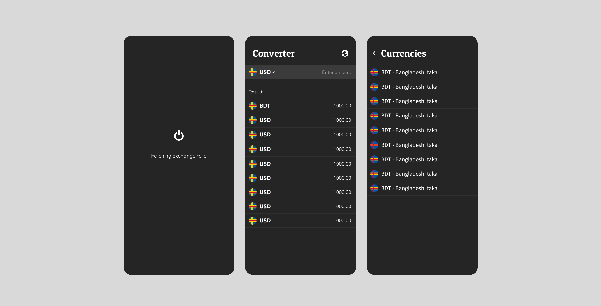
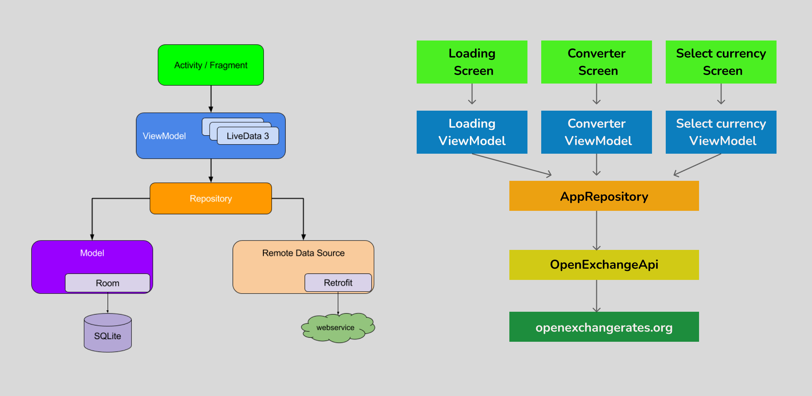

# Currency-Converter-Android-App
Android Currency Converter App (MVVM, Hilt, Retrofit, Coroutines, Flow) offers real-time currency conversion with Jetpack Compose.

## Contents
- [Functional Requirements](#functional-requirements)
- [Initial UI Design](#initial-ui-design)
- [App Architecture](#app-architecture)
- [Commits](#commits)
- [How to get the APK](#how-to-get-the-apk)

## Functional requirements
- Fetch latest data on app startup
- Show available currencies
- Change input currency
- Change input amount
- Show converted amount in all available currency

## Initial UI design

## App Architecture

## Commits
- [Initial commit](https://github.com/gobinda1547/Currency-Converter-Android-App/commit/742d132c69eb1db109e8ee5a31fd43625e459738)
- [Adding empty android studio project](https://github.com/gobinda1547/Currency-Converter-Android-App/commit/9bae988cbf1e7d5b8cc2a46c477d6154960ca5d8)
- [Configured hilt dependency injection library](https://github.com/gobinda1547/Currency-Converter-Android-App/commit/19def8f5f3ea045071497984627f11832b5b6a39)
- [Completed data layer implementation with test cases](https://github.com/gobinda1547/Currency-Converter-Android-App/commit/d6fec362171ad3b31349ee747337a1c5e8e8fd1d)
- [Loading screen implementation done](https://github.com/gobinda1547/Currency-Converter-Android-App/commit/e920eec1646046eec78648bb2523d7220fe2442b)
- [Adding imageKit module & imported all the country images](https://github.com/gobinda1547/Currency-Converter-Android-App/commit/a67cd4a951fa03f60a6d4379a6dc02d254148648)
- [Currency list screen implementation done](https://github.com/gobinda1547/Currency-Converter-Android-App/commit/cece766495156c785c81d1112f8cae29f4bf35e7)
- [Converter screen implementation done](https://github.com/gobinda1547/Currency-Converter-Android-App/commit/79c5632fa5c5a9eb4ac8e1891a99e7a73c4a86dc)
- [SelectCurrency screen implementation done](https://github.com/gobinda1547/Currency-Converter-Android-App/commit/9e70d4c60cba627384e4e07bd98f5f1577cd7e1d)

## How to get the APK
- Pull the project (master branch)
- Open Android studio & import the project
- Create a resource file with name 'confidential.xml' 
- declare your open exchange service's APP_ID as a string with key 'APP_ID_OPEN_EXCHANGE_SERVER'
- Sync project file & wait for build to finish
- Now generate DEBUG or RELEASE apk as your need.